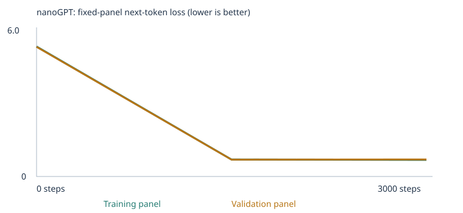

# Ethan's Custom LLM Experiment

I trained Karpathy's nanoGPT from scratch on a small word-token corpus, inspected what it
actually learned inside, evaluated it with a fixed 48-case language suite, and built a chat
interface around it. This README covers two runs: a **starter run** on the supplied classroom
corpus, and a **corpus-extension run** where I added my own teaching material for the
*negation* and *opposites* eval categories. Everything below is drawn directly from my own
executed notebooks and saved results — nothing here needs to be rerun to be checked.

*(General project/notebook setup docs from the starter template live in [PROJECT_SETUP.md](PROJECT_SETUP.md).)*

## Overview

- **Notebooks:** [`custom_llm_starter.ipynb`](custom_llm_starter.ipynb) and
  [`custom_llm_expanded.ipynb`](custom_llm_expanded.ipynb), both executed in Google Colab with
  outputs intact.
- **Corpus additions:** [`corpus/negation.txt`](corpus/negation.txt) and
  [`corpus/opposites.txt`](corpus/opposites.txt) — 18 sentences each, written by me for this
  assignment. No external source: no scraped text, no PDFs, so there was no extraction step or
  OCR/encryption warnings to check. Plain UTF-8 `.txt`, which the notebook confirmed importing
  cleanly (section 3 output, mirrored in
  [`evidence/expanded/corpus_manifest.json`](evidence/expanded/corpus_manifest.json), shows
  zero warnings for both files).
- **To open and run:** open either notebook link above directly on GitHub to read the executed
  cells, or open [the notebook in Colab](https://colab.research.google.com/github/pepealonso95/custom-llm/blob/main/custom_llm.ipynb),
  save your own copy, paste in my corpus files (for the expanded run), and Run All. Default CPU
  runtime is enough — I trained on Colab's free CPU tier.

## What I taught it, and why

I kept `CORPUS = "classroom"` for both runs so my additions sit on top of the supplied
sentences rather than replacing them, and I used `LEARNING_RATE = 0.001` throughout — the
notebook's suggested starting point, with its own warmup and cosine decay. I ran
`TRAINING_STEPS = 10` first purely to confirm the pipeline worked end to end, then
`TRAINING_STEPS = 3000` for both real experiments.

For the corpus extension, I picked **negation** and **opposites** because they seemed like the
most teachable extension categories with a small, repeatable sentence template — "X did not do
A. X did B instead" and "A is the opposite of B." I wrote 18 original sentences per category
(see the files linked above), varying the names, objects, and situations so the model would see
the *pattern*, not one memorized sentence.

| | Starter | Expanded |
|---|---|---|
| Unique passages (after dedup) | 4,592 | 4,649 (+57 from my files) |
| Train / validation documents | 4,132 / 460 | 4,184 / 465 |
| Vocabulary size (retained types) | 136 (133 word types + UNK/BOS/EOS) | 230 (227 word types + UNK/BOS/EOS) |
| Training unknown-token rate | 0.0% | 0.0% |
| Validation unknown-token rate | 0.0% | 0.25% |

Both runs retained **every** training token type — nothing hit the 509-type cap, so nothing got
pruned to UNK. Full detail: [`evidence/starter/corpus_manifest.json`](evidence/starter/corpus_manifest.json) /
[`evidence/expanded/corpus_manifest.json`](evidence/expanded/corpus_manifest.json), and
[`evidence/starter/vocabulary_report.json`](evidence/starter/vocabulary_report.json) /
[`evidence/expanded/vocabulary_report.json`](evidence/expanded/vocabulary_report.json). Since
the split is by deduplicated passage rather than by source file, "held-out" here means new
sentence combinations from the same templates, not unseen topics.

## Prediction vs. what actually happened

Before the 10-step sanity check, I predicted: *"I expect the model to produce mostly gibberish
— random or repeated tokens with little grammatical structure. Ten weight updates isn't nearly
enough to learn meaningful patterns; at best it might start slightly favoring more frequent
tokens over a purely random distribution."* That's exactly what I got —
[`evidence/starter/samples/step_0000.txt`](evidence/starter/samples/step_0000.txt) is
unstructured word soup (`"website doctor light cloudy mango wore pear..."`).

Going into the full 3,000-step runs, I expected the much larger loss drop to produce fully
grammatical sentences (it did — see below), and I expected the corpus extension to noticeably
improve the negation/opposites eval scores (it didn't). That second miss turned out to be the
most useful finding of the whole assignment, because tracking down *why* revealed something
real about how this pipeline handles small, narrow additions — not a bug, but a genuine
limitation I explain in detail further down.

## The runs themselves

Both used the same architecture: nanoGPT, `n_embd=64`, `n_head=4`, `n_layer=2`,
`block_size=48`, `batch_size=32`, seed 42, CPU-only (Colab), PyTorch 2.11.0+cpu. Neither run was
interrupted.

| | Starter | Expanded |
|---|---|---|
| Steps completed | 3,000 / 3,000 | 3,000 / 3,000 |
| Elapsed time | ~57 seconds | ~60 seconds |
| Parameters | 111,872 | 117,888 |

Config/summary files: [`evidence/starter/config.json`](evidence/starter/config.json),
[`evidence/starter/training_summary.json`](evidence/starter/training_summary.json),
[`evidence/expanded/config.json`](evidence/expanded/config.json),
[`evidence/expanded/training_summary.json`](evidence/expanded/training_summary.json).

**Loss** (fixed panels of 20 train / 20 validation documents, mean loss over non-padding
next-token targets — full histories:
[starter](evidence/starter/history.json), [expanded](evidence/expanded/history.json)):

| Step | Train loss | Val loss |
|---|---|---|
| 0 | 4.9263 | 4.9275 |
| 1,500 | 0.6821 | 0.7182 |
| 3,000 | 0.6783 | 0.7061 |

| Step | Train loss | Val loss |
|---|---|---|
| 0 | 5.4369 | 5.4196 |
| 1,500 | 0.7097 | 0.7045 |
| 3,000 | 0.6927 | 0.7132 |

One thing I noticed rather than smoothed over: in the expanded run, validation loss actually
rises slightly between step 1,500 and 3,000 (0.7045 → 0.7132) while training loss keeps
dropping — a small, early overfitting signal. I wouldn't read too much into it given how tiny
the validation panel is (20 documents), but it's a real pattern in the numbers, so I'm reporting
it rather than ignoring it.

**Samples**, same generation settings throughout, full files linked (including the raw,
sometimes-garbled early output):
[starter step 0](evidence/starter/samples/step_0000.txt) → [1,500](evidence/starter/samples/step_1500.txt) →
[3,000](evidence/starter/samples/step_3000.txt) (*"the team discussed the professor and the
learning at the school ."*); [expanded step 0](evidence/expanded/samples/step_0000.txt) →
[1,500](evidence/expanded/samples/step_1500.txt) → [3,000](evidence/expanded/samples/step_3000.txt)
(*"the team discussed the mango and the juice at the kitchen ."*).

## How this model actually learns — traced through one real word

Everything here comes from [`evidence/expanded/inspection.json`](evidence/expanded/inspection.json)
and [`evidence/expanded/tokenization.json`](evidence/expanded/tokenization.json).

A **corpus** is just the text I feed in; a **token** is one word or punctuation mark the text
gets split into. Every token gets an arbitrary integer **ID** — the word "customer" happens to
be **token ID 45** in this vocabulary. That ID indexes into a lookup table of **embeddings**:
one 64-number vector per token, which is what the network actually reads and writes to. Before
training, "customer"'s vector starts as small random noise (first three of its 64 numbers:
`-0.0311, 0.0250, 0.0092`); after 3,000 steps it's moved to `0.0332, 0.0332, -0.0478` — those
64 numbers are the network's compressed representation of how "customer" behaves in context, and
they only shifted because training pushed them there.

Here's a real, single parameter update from that same vector, its first coordinate: before
training that number was `-0.0311128`. The network's error on that step produced a gradient of
`-0.0010441` for it, and at that point in training the (warmup-scaled) learning rate was
`1e-05`. AdamW turned that into an update of about `+0.00001`, landing at `-0.0311028`. Notice
the step size (~1e-5) is close to the *learning rate itself*, not `gradient × learning_rate`
(which would be ~1e-8) — that's because AdamW normalizes each update by its running estimate of
the gradient's scale, so it doesn't take a plain gradient-proportional step the way basic SGD
would.

The clearest evidence that this actually changed the model's behavior: next-token probabilities
for the prompt **"the customer"**, over the full 230-word vocabulary. Untrained, the top guess
was "customer" itself at just **0.95%** — essentially flat and random. Trained, the top guess
became **"compared" at 20.5%**, followed by reviewed / returned / ordered / selected — precisely
the verbs the classroom corpus's templates use right after "the customer/client/buyer...". That
shift, from near-uniform to a sharp, correct-shaped distribution, is loss dropping from ~5.4 to
~0.7 made concrete.

## Attention, generation, and temperature

Each output position attends only to tokens **at or before** it — the `attention_rows` in
`inspection.json` are lower-triangular, meaning a token literally cannot see what comes after
it. That's what makes "predict the next token" a well-posed task instead of a paradox. At each
step, the network turns its internal state into a probability over every vocabulary token, and
generation samples from that distribution one token at a time, feeding each choice back in as
context for the next.

**Temperature** reshapes that probability distribution before sampling, without touching any
weights — same prompt, same seed, three different temperatures
([`evidence/expanded/temperature_comparison.json`](evidence/expanded/temperature_comparison.json)):

- **T=0.3:** *"the team discussed the professor and the learning at the school ."* — sharpens
  toward the single most likely path, almost deterministic.
- **T=0.8:** *"the team discussed the mango and the juice at the kitchen ."* — same grammatical
  frame, different plausible word fills.
- **T=1.2:** *"has team discussed the mango and the juice at the kitchen ."* — flattens the
  distribution enough that a lower-probability, ungrammatical choice ("has team" instead of "the
  team") slips through.

## One limitation, explained, and what I'd try next

The corpus extension didn't move the needle on `extend_corpus` eval cases at all — 0/24 correct
before and after, with only 1 of 24 even scorable. My first guess was that the 509-token
vocabulary cap had pruned my new words, but `vocabulary_report.json` rules that out: **zero**
types were omitted in either run. So I checked the actual failing eval cases directly.

Two real causes, both explainable and neither a training bug:

1. **Vocabulary mismatch.** The 24 `extend_corpus` cases span all 8 extension categories, and I
   only wrote material for 2 of them. Worse, even within negation/opposites, the eval cases use
   specific words — "ava," "box," "door," "buy," "noisy," "soft" — that I never happened to use
   anywhere in my sentences. Those cases were always going to be unscorable, independent of how
   much training happened.
2. **Single-occurrence words and the random split.** One case needed "quiet," which I *did*
   teach ("loud is the opposite of quiet ."), but it still shows as unknown. Vocabulary is built
   only from the training split, and the notebook's 90/10 passage split is random — a word
   appearing in exactly one passage has roughly a 1-in-10 chance of that passage landing
   entirely in validation, taking the word out of the trained vocabulary with it.

**Next experiment I'd run:** rewrite the negation/opposites files to reuse the general
vocabulary those eval cases actually rely on (without copying the eval prompts or answers
themselves), and repeat each key word across 3–4 different sentences instead of one, so no
single word is one unlucky split away from disappearing. I'd predict that gets the scorable
count well past 1/24 — though not close to 24/24, since 6 of the 8 extension categories still
wouldn't have any teaching material behind them.

## Evals: how they're scored, what I found, and how leakage was checked

**Scoring:** each of the 48 fixed cases in [`evals/language_evals.json`](evals/language_evals.json)
gives the model a prompt and 4 single-word choices; it scores 1 if the trained model assigns the
*highest* probability to the correct choice, 0 otherwise (ties score 0). Cases where the prompt
or an answer choice uses a word outside the model's vocabulary are marked unscorable and count
as 0 in the all-case rate — that's a coverage gap, not a wrong answer. The model's free-text
continuation is saved separately and isn't part of this score. Runner:
[`run_evals.py`](run_evals.py).

**Results**, all four required sets:

| Experiment | Stage | Correct / 48 | Scorable / 48 | Accuracy on scorable cases | Full results |
|---|---|---|---|---|---|
| Starter | Untrained | 9 | 24 | 37.5% | [link](evidence/starter/language_evals/untrained/) |
| Starter | Trained | 20 | 24 | 83.3% | [link](evidence/starter/language_evals/final/) |
| Expanded | Untrained | 6 | 25 | 24.0% | [link](evidence/expanded/language_evals/untrained/) |
| Expanded | Trained | 21 | 25 | 84.0% | [link](evidence/expanded/language_evals/final/) |

Combined comparison files:
[starter](evidence/starter/language_eval_comparison.json),
[expanded](evidence/expanded/language_eval_comparison.json). Breaking it down by group after
training: `starter_patterns` hit 16/16 in both runs — the model clearly learned the
domain-noun/context/place associations from the templates. `starter_transfer` (familiar words,
new phrasing) improved too, 4/8 → 5/8 with the extension. `extend_corpus` is the flat 0/24
covered above.

**Leakage check:** [`evidence/expanded/eval_separation.json`](evidence/expanded/eval_separation.json)
confirms 160 reserved passages were excluded before splitting or building vocabulary, in both
runs, via normalized contiguous-prompt matching. I also manually re-read
`negation.txt`/`opposites.txt` against the 48 cases myself, since the automated check is a
string match, not a semantic one, and I never pasted eval prompts, choices, or answers into the
corpus or generated training text. These are public tests I used to steer the extension corpus
during development — not a held-out final benchmark.

## Chat interface

**To launch:** open [`custom_llm_expanded.ipynb`](custom_llm_expanded.ipynb) section 10 in
Colab — it reuses the model already trained in that session, no extra setup. To run it
standalone instead: `pip install -r requirements.txt`, then
`python chat.py --model evidence/expanded/model.pt --transcript new_chat.json`. Model identity:
the `model_sha256` recorded in
[`evidence/expanded/chat_transcript.json`](evidence/expanded/chat_transcript.json) matches the
expanded run's final checkpoint (3,000 completed steps).

Screenshot: [`evidence/chat_screenshot.png`](evidence/chat_screenshot.png). Six real
interactions ([full transcript](evidence/expanded/chat_transcript.json)):

| Prompt | Response | Note |
|---|---|---|
| "the customer" | "compared the merchandise after checking the price ." | in-domain, grammatical |
| "the doctor" | "was focused on patient ." | in-domain, grammatical |
| "the astronaut" | "is local truck ." | **limitation** — "astronaut" is unknown; output falls apart |
| "the dog" | "did not tea ." | picked up negation *syntax*, applied it nonsensically |
| "the local man" | "the client ." | "man" is an unknown word |
| "the teacher" | "reviewed the item after checking the price ." | in-domain, grammatical |

**Limitation:** every prompt starts a fresh context — `fresh_context_per_prompt: true` in the
transcript, no memory across turns. The model only knows the ~230 word types it trained on;
anything outside that (like "astronaut") produces ungrounded output, as shown above. It's a
narrow sentence-continuation model, not a general assistant, and chatting with it never feeds
those messages back into training or the corpus.

## Reproduce this

- Notebooks: [`custom_llm_starter.ipynb`](custom_llm_starter.ipynb),
  [`custom_llm_expanded.ipynb`](custom_llm_expanded.ipynb) — open directly on GitHub to read
  executed outputs, or in Colab to rerun.
- My corpus additions: [`corpus/negation.txt`](corpus/negation.txt),
  [`corpus/opposites.txt`](corpus/opposites.txt) (force-committed despite the template's default
  `corpus/*` gitignore, since this is original, non-sensitive text).
- Every result file (loss history, eval CSVs/JSONs, samples, inspection data, trained weights)
  is under [`evidence/starter/`](evidence/starter/) and [`evidence/expanded/`](evidence/expanded/).
